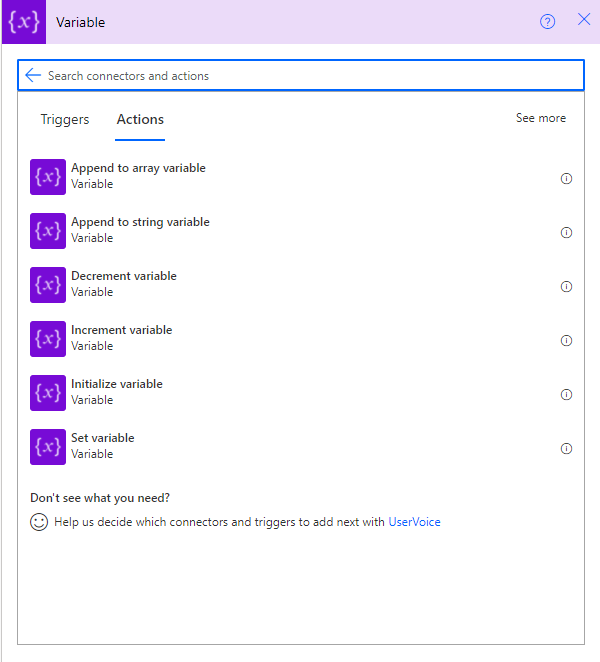

About the course:
[Click here to see more details](https://eylearning.udemy.com/course/microsoft-power-automate-crash-course)

## 001 - What is Power Automate

- It is a platform on Microsoft Cloud for creating workflows to interact with people as well as other systems
- It is web based interface (Everything is done in the web browser)
- It is built for business users (not developers), so it is easy to learn

## 002 - Working with Power Automate Triggers

- **What is triggers?**
    
    Triggers is something that starts our flows. And, in Microsoft Power Automate, exists differents types of triggers.
    
    - Manually triggers ⇒ triggers that are manually fired by user or a progra
    - Recurrence (Schedule) triggers ⇒ Triggers that are fired on schedule
    - Events that occurs based in another action. Ex.: When a file in SharePoint is created ⇒ Triggers that monitor and react to an external event
    

## 003 - Working with Power Automate Actions

### Learning OData syntax

OData syntax is an intelligent way to filtering data from databases. In this case we are filtering data from a SharePoint List. To use OData query, we need to follow certain type of syntax. Below, has a link that clarify this sintax:

### OData URIS:

[Using Filter Expressions in OData URIs - Dynamics NAV](https://docs.microsoft.com/en-us/dynamics-nav/using-filter-expressions-in-odata-uris)

### Deleting and Updating Items using Power Automate Flow

- To do that actions, first of all, we need that our items in the list must have an ID.
- If we don’t have item ID, the flow fails

→ To delete an item from SharePoint List, we must use the action called **“Delete Item”**

→ To update an item form SharePoint List, we must use the action called **“Update Item”**

Tips:

- If you don’t have the ID, search for the items using **“Get Items”** and use the returned ID to update/delete the desired list item

## 004 - Working with Power Automate Data Types and Variables

Actions that manage variables in Power Automate

  

## 005 - Working with Flow Control Actions and Basics Error Handling

- IF’S
- Switch
- Loops
    - Apply to each
    - Do until

### Error handling

- To configure error handling ⇒ configure the **“Run after”** action
    - “Run after” fires actions that will only execute if the run after property is satisfied
- Other way to configure error handle is through **“Scope”** action. Scope actions is a block, that throws an error to all actions inside of it. Note that error which was thrown, will be the same for every action inside the Scope.
    - Variables can not be **initialized** inside the **Scope** block.

### Branching the flow

- Typically we use branching when we are dealing with user approval request
- If all approvers should vote on one request, wait for approval does the branching
- If different approval requests are supposed to be sent to multiple approvers then use actual flow branching

## 006 - Power Automate Security

- **Owner:** Is the person who creates the Flow
- **Co-owners:** are the users that can make changes in the Flow
- **Run-only users:** These users can have access to the Flow and start with manual trigger, but they cannot make changes in the Flow